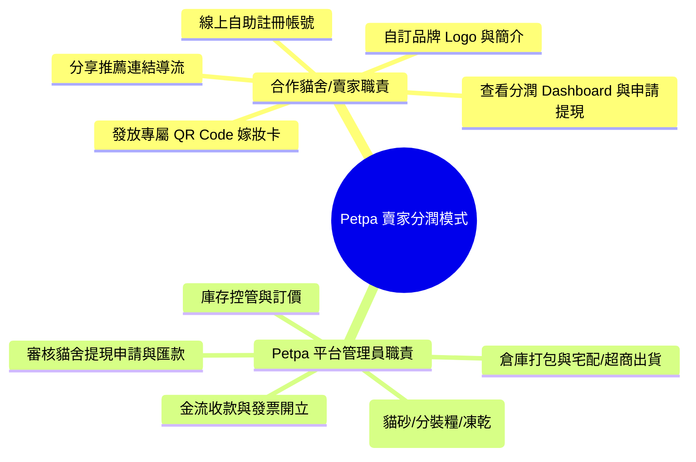

# 📋 Petpa 寵物補給站 - 商業規則與營運規範 (Business Rules & Operations)

本文檔完整規範 **Petpa 合作貓舍/賣家自助註冊與分潤平台** 之商業模式、賣家與管理員權責劃分、商品管理權限、貓舍分潤控制台與提現申請規範。

---

## 📝 1. 貓舍/賣家自助註冊與審核規則 (Partner Registration Rules)

1. **線上自助註冊**：
   - 賣家/貓舍負責人於 `shop.petpa/register` 填寫帳號 Email、密碼、貓舍名稱、品牌簡介與匯款銀行資訊。
2. **自動生成專屬頁面**：
   - 註冊完成後，系統自動生成該貓舍專屬的網址路徑（如 `shop.petpa/?cattery=meow_house`）與高清專屬 QR Code 圖檔。
3. **品牌資訊自主編輯**：
   - 貓舍登入專屬控制台後，可隨時更新貓舍 Logo、形象 Banner、品牌介紹與銀行帳戶資訊。

---

## 🔒 2. 商品統一管理規範 (Centralized Product Management)

1. **商品權限完全歸屬於平台管理員 (Admin Only)**：
   - 貓舍/賣家**無權新增、修改或刪除商品價格與庫存**。
   - 所有商品（貓砂、分裝飼料、凍乾零食）由 Petpa 平台管理員統一進行採購、品質品管、上架、訂價、庫存控管與打包出貨。
2. **零庫存壓力**：
   - 賣家無須預先進貨或積壓庫存成本，僅需專注於分享 QR Code 嫁妝卡與顧客推薦導流。

---

## 📊 3. 貓舍分潤控制台與提現規範 (Commission Dashboard & Withdrawal)

### 3.1 美觀的數據大盤 (Ant Design Dashboard)
- 貓舍控制台即時顯示四大指標：`本月預估分潤`、`可提領餘額`、`總導流訂單數`與`顧客回購率`。
- 提供 30 天每日導流銷售趨勢圖表與詳細導流訂單號明細。

### 3.2 提現與撥款規則 (Withdrawal Rules)
1. **提現門檻**：當「可提領餘額」達到 **NT$ 1,000 元** 時，貓舍可隨時於控制台點擊「一鍵申請提現」。
2. **訂單過鑑賞期撥款**：訂單狀態轉為 `Completed`（完成出貨且超過 7 天鑑賞期）後，該筆分潤金額即自動轉入「可提領餘額」。
3. **平台審核與匯款**：
   - 平台管理員於收到提現申請後 3 個工作天內完成銀行轉帳，並於後台註記交易單號。

---

## 🏢 4. 平台與合作貓舍權責劃分 (Responsibilities)

---

## 🎯 5. 第一階段 (MVP) 實施邊界 (Phase 1 Scope)

- **含入功能 (In Scope)**：
  - 貓舍/賣家線上自助註冊與登入。
  - 自動生成專屬一頁式商城與高清 QR Code 工具包。
  - 平台管理員統一商品上架與庫存管理介面。
  - 螞蟻金融風格 (Ant Design Pro) 貓舍分潤控制台（含 KPI、趨勢圖與提現申請）。
  - 一頁式購物車與金流串接。

- **暫不含入功能 (Out of Scope for Phase 1)**：
  - 多層級經銷分潤 (MLM multi-level marketing)。
  - 貓舍自訂動態促銷折價券（由平台統一發放）。
