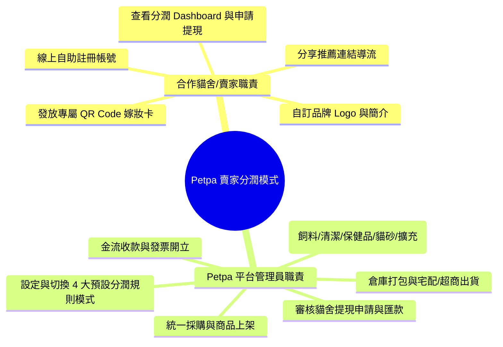

# 📋 Petpa 寵物補給站 - 商業邏輯與營運規範手冊 (Business Rules & Operations)

本文檔詳細規範 **Petpa 合作貓舍/賣家分潤電商平台** 之營運邏輯、貓舍自助註冊流程、動態商品分類管理、4 大預設分潤模式試算、一頁式結帳來源綁定，以及提現撥款規範。

---

## 📝 1. 貓舍/賣家自助註冊與帳號規範 (Partner Registration)

1. **線上自助註冊**：
   - 賣家/貓舍負責人於 `shop.petpa/register` 輸入 Email、密碼、貓舍名稱、品牌簡介與匯款銀行帳戶資訊。
2. **自動生成專屬連結與 QR Code**：
   - 註冊完成後，系統自動於 MongoDB Atlas 建立 `catteryProfile`，並生成專屬帶參 URL（如 `https://shop.petpa/?cattery=meow_house`）與高清晰度 QR Code 圖檔（供印製幼貓嫁妝卡）。
3. **品牌資訊自主管理**：
   - 貓舍登入專屬 Ant Design 控制台後，可隨時維護貓舍 Logo、Banner、簡介與變更匯款銀行資訊。

---

## 🗂️ 2. 自定義動態商品分類規範 (Categories Rules)

1. **基本預設分類**：
   - 🍚 **飼料 (Cat Food / Portioned Food)**：幼貓與成貓鮮採小包裝糧、主糧。
   - 🧼 **清潔 (Cleaning & Grooming)**：寵物洗劑、除臭噴霧、環境清潔用品。
   - 💊 **保健品 (Health Supplements)**：排毛粉、益生菌、魚油、維他命等高毛利品項。
   - 🏖️ **貓砂 (Cat Litter)**：豆腐砂、礦砂、木屑砂。
2. **管理員動態擴充**：
   - 平台管理員可於後台隨時「新增/編輯/排序/停用」分類（例：新增「凍乾零食」、「主食罐頭」、「貓抓板玩具」）。
   - 前台一頁式商城與分類篩選列將即時同步，無須重新發佈或關閉服務。

---

## 🧮 3. 4 大預設分潤規則模式與運算規範 (Preset Commission Models)

平台管理員可於後台切換全站預設分潤模式，或針對特定合作貓舍設定獨立規則：

```mermaid
graph TD
    RuleEngine[🧮 分潤運算引擎 (Commission Engine)]
    RuleEngine --> M1[模式 1: 固定百分比模式 (Fixed %)]
    RuleEngine --> M2[模式 2: 按商品分類差異模式 (Category-Based)]
    RuleEngine --> M3[模式 3: 階梯累計獎勵模式 (Tiered Volume)]
    RuleEngine --> M4[模式 4: 新客首單高額模式 (First-Time Bounty)]
```

### 模式 1: 固定百分比模式 (Fixed Percentage)
- **運算邏輯**：不分商品類別，統一按訂單商品小計計算固定分潤（如 **15%**）。
- **公式**：$\text{分潤金額} = \text{商品小計} \times 15\%$

### 模式 2: 按商品分類差異模式 (Category-Based)
- **運算邏輯**：依據不同商品分類之毛利率設定分潤率：
  - 💊 **保健品**：**25%**（高毛利高獎勵）
  - 🧼 **清潔用品**：**20%**
  - 🍚 **飼料糧食**：**15%**
  - 🏖️ **貓砂大宗**：**10%**（跑量低毛利）

### 模式 3: 階梯累計獎勵模式 (Tiered Volume Incentive)
- **運算邏輯**：依據貓舍當月累積導流成交金額，階梯式提高分潤比率：
  - 當月累積金額 $\le \$50,000$：**12%**
  - 當月累積金額 $\$50,001 \sim \$100,000$：**15%**
  - 當月累積金額 $> \$100,000$：**18%**
- **控制台反饋**：貓舍控制台顯示實時進度條（如：「再導流 $6,500 元即可解鎖 18% 最高階分潤！」）。

### 模式 4: 新客首單高額模式 (First-Time Buyer Bounty)
- **運算邏輯**：新家長首次透過該貓舍 QR Code/連結下單，給予高額首單分潤，鎖定後續回購：
  - 家長首次下單：**20%**
  - 第二次及後續回購：**12%**

---

## 🔒 4. 商品統一託管與賣家權限 (Centralized Product Control)

1. **商品與分類上架權限**：完全歸屬於 **Petpa 平台管理員 (Admin Only)**。
2. **賣家零庫存壓力**：貓舍/賣家無須預先進貨囤貨，僅需發放專屬 QR Code 嫁妝卡與推廣連結。

---

## 📊 5. 貓舍分潤控制台與提現規範 (Commission Dashboard & Withdrawal)

### 5.1 控制台與指標
- **AntD 數據大盤**：即時顯示 `本月預估分潤`、`可提領餘額`、`累積導流訂單` 與 `顧客回購率`。
- **推廣工具包**：一鍵下載高清專屬 QR Code 圖檔（方便印製新家嫁妝卡）、一鍵複製推廣連結。

### 5.2 提現與撥款規範
1. **提現門檻**：當「可提領餘額」達 **NT$ 1,000 元** 時，貓舍可隨時於控制台點擊「一鍵申請提現」。
2. **過鑑賞期自動解鎖**：訂單發貨後超過 **7 天鑑賞期**（狀態轉為 `Completed`），對應分潤金額即自動由預估金額轉入「可提領餘額」。
3. **平台審核撥款**：平台管理員收到申請後 3 個工作天內完成銀行轉帳，並於後台註記轉帳交易序號。

---

## 🏢 6. 平台與合作貓舍權責劃分 (Responsibilities)


