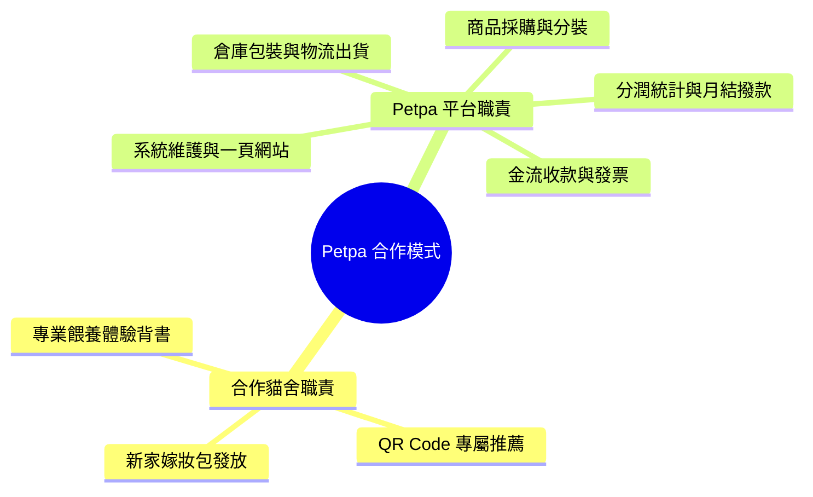

# 📋 Petpa 寵物補給站 - 商業規則與營運規範 (Business Rules & Operations)

本文檔完整規範 **Petpa 合作貓舍一頁式平台** 之商業模式、貓舍分潤計算、訂單來源追蹤邏輯、商品與運費規範，以及第一階段 (MVP) 實施邊界。

---

## 🤝 1. 合作貓舍導流與綁定規則 (Cattery Referral Rules)

### 1.1 專屬頁面與 QR Code 生成
1. 每一家簽約合作貓舍皆配發唯一識別碼（`catteryId`，如 `cattery_001`）。
2. 系統自動生成專屬 QR Code 及專屬網址 URL（例如 `https://shop.petpa/?cattery=cattery_001`）。
3. 貓舍將實體 QR Code 印製於新家嫁妝包卡片或隨貓文件交付予貓咪家長。

### 1.2 來源追蹤與長期綁定 (Source Attribution)
1. **第一次進入綁定**：當家長透過 QR Code 或專屬連結進入網站時，系統自動將 `catteryId` 寫入客戶端 `LocalStorage` 與 `Cookie`（有效期限 365 天）。
2. **無縫回購追蹤**：即使家長日後直接輸入 `shop.petpa` 進行回購，只要未更換裝置或清除 Cookie，系統下單時仍會自動帶入原合作貓舍之 `catteryId`。

---

## 💰 2. 貓舍分潤與結算機制 (Commission Rules)

### 2.1 分潤計算公式
$$ \text{貓舍單筆分潤金額} = (\text{商品小計} - \text{折扣金額}) \times \text{分潤比例 (例如 15\%)} $$
*(註：運費與金流手續費不列入分潤計算基數)*

### 2.2 結算與撥款時程
- **計算週期**：每月 1 號統計上月 `Completed` (已完結且過 7 天鑑賞期) 之訂單。
- **報表發放**：每月 5 號自動產出「貓舍月結對帳單」發送至貓舍負責人 Email。
- **撥款日期**：每月 15 號統一匯款至貓舍指定銀行帳戶。

---

## 📦 3. 初期商品與分類規範 (Product Catalog & Inventory)

第一階段聚焦於高需求、高回購率之三大核心貓用商品：

| 分類名稱 | 核心品項 | 特點與營運規範 |
|---|---|---|
| **貓砂 (Cat Litter)** | 豆腐砂、無塵礦砂 | 大宗回購商品，提供 3 包 / 6 包箱購優惠組 |
| **分裝飼料 (Portioned Cat Food)** | 幼貓鮮採小包裝糧 | 衛生封口分裝，解決家長貓咪轉換飼料適口性問題 |
| **凍乾零食 (Freeze-Dried Treats)** | 雞胸肉、鮭魚、干貝凍乾 | 原肉凍乾，適合作為互動獎勵與飼料誘食 |

---

## 🛒 4. 一頁式結帳與金流規範 (Checkout & Payments)

1. **極簡化步驟**：
   - 掃碼 ➔ 選擇商品數量 ➔ 填寫收件資訊 ➔ 付款，全程單一頁面，無強制註冊流程。
2. **金流管道**：
   - 信用卡（支援分期/一次付清）
   - LINE Pay 快速支付
   - 超商代碼 / 條碼繳費
   - 宅配貨到付款

---

## 🏢 5. 平台與合作貓舍權責劃分 (Responsibilities)

---

## 🎯 6. 第一階段 (MVP) 實施邊界 (Phase 1 Scope)

第一階段專注於**快速上線驗證商業閉環**：

- **含入功能 (In Scope)**：
  - 合作貓舍專屬頁面樣板（帶入 Logo、貓舍簡介與專屬商品推薦）。
  - 一頁式購物車與商品列表（貓砂、分裝糧、凍乾）。
  - 訂單 `catteryId` 來源自動紀錄與歸屬。
  - 基礎模擬金流 / 綠界金流串接。
  - 後台基本訂單與貓舍分潤統計報表。

- **暫不含入功能 (Out of Scope for Phase 1)**：
  - 多貓舍自訂高級 CSS 主題。
  - 定期自動扣款訂閱制（於 Phase 2 推出）。
  - 複雜的紅利點數與禮券系統。
