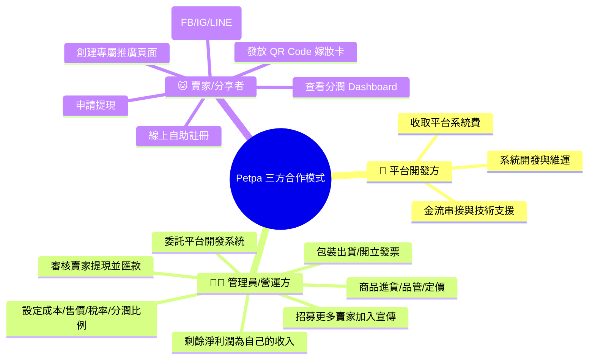

# 📋 Petpa 寵物補給站 - 商業邏輯與營運規範手冊 (Business Rules & Operations)

本文檔詳細規範 Petpa 平台之三方合作盈利模型、管理員淨利潤計算邏輯、賣家分潤規則、稅務估算機制、社群行銷工具規範，以及各方權責劃分。

---

## 💰 1. 三方合作盈利模型 (Three-Party Profit Model)

### 1.1 角色定義與盈利邏輯

| 角色 | 身份說明 | 職責 | 盈利方式 |
|---|---|---|---|
| **🏢 平台 (Platform)** | 系統開發與維護方 | 開發系統、維護伺服器、提供金流與技術支援 | 從每筆訂單淨利潤中收取固定比例**平台系統費** |
| **👨‍💼 管理員 (Operator)** | 委託平台開發系統的實際經營者 | 招募賣家加入、進貨採購、品管、包裝出貨、開立發票 | 淨利潤扣除平台費與賣家分潤後，**剩餘全部歸管理員** |
| **🐱 賣家 (Seller)** | 合作貓舍、寵物社群推廣者 | 註冊創建專屬推廣頁面、發放 QR Code、社群宣傳導流 | 從每筆導流訂單淨利潤中收取**賣家推廣分潤** |

### 1.2 淨利潤計算公式

$$\text{淨利潤 (Net Profit)} = \text{售價} - \text{進貨成本} - \text{估算稅金}$$

$$\text{平台系統費} = \text{淨利潤} \times \text{平台費率 (\%)}$$

$$\text{賣家分潤} = \text{淨利潤} \times \text{賣家分潤率 (\%)}$$

$$\boxed{\text{管理員實際利潤} = \text{淨利潤} - \text{平台系統費} - \text{賣家分潤}}$$

### 1.3 分潤比例設定規範
- **最小調整單位**：**0.5%**（可設定 5.0%、5.5%、6.0%⋯等精細粒度）。
- **管理員利潤不需要設定**：管理員利潤 = 100% - 平台費率 - 賣家分潤率，系統自動計算剩餘。
- 管理員於後台僅需設定兩個數值：**平台系統費率** 與 **賣家分潤率**。

### 1.4 系統利潤總覽試算表（管理員後台即時顯示）

以一件商品為例：售價 NT$ 500、進貨成本 NT$ 200、稅率 5%

| 項目 | 金額 | 占淨利潤比例 |
|---|---|---|
| 售價 | NT$ 500 | — |
| ➖ 進貨成本 | NT$ 200 | — |
| ➖ 估算稅金 (5%) | NT$ 25 | — |
| **淨利潤** | **NT$ 275** | **100%** |
| 🏢 平台系統費 | NT$ 27.5 | 10.0% |
| 🐱 賣家推廣分潤 | NT$ 41.25 | 15.0% |
| 👨‍💼 **管理員實際利潤** | **NT$ 206.25** | **75.0% (自動剩餘)** |

---

## 📊 2. 稅務估算機制 (Tax Estimation)

> ⚠️ **重要聲明**：系統中所有稅務相關數字均為**估算參考值 (Estimated)**，旨在協助管理員快速評估商品定價與利潤空間。**實際稅務申報與繳稅義務請依據當地稅法規定，並諮詢專業會計師辦理。**

### 2.1 稅率設定
- 管理員可於上架商品時設定該品項之**估算稅率**（預設 **5%** 營業稅）。
- 系統根據**售價 × 稅率**自動估算稅金金額。
- 所有報表與 Dashboard 中的稅金欄位均標示「*(估算)*」字樣。

### 2.2 管理員後台稅務報表顯示
- **單品利潤卡**：顯示售價、成本、*估算稅金*、淨利潤。
- **月報表**：彙總全月銷售額、總*估算稅金*、總淨利潤（方便管理員提供給會計師參考）。

---

## 🗂️ 3. 自定義動態商品分類規範

1. **基本預設分類**：
   - 🍚 **飼料**：幼貓與成貓鮮採小包裝糧、主糧。
   - 🧼 **清潔**：寵物洗劑、除臭噴霧、環境清潔用品。
   - 💊 **保健品**：排毛粉、益生菌、魚油、維他命等。
   - 🏖️ **貓砂**：豆腐砂、礦砂、木屑砂。
2. **管理員動態擴充**：可隨時新增/編輯/排序/停用分類（如凍乾零食、主食罐頭、貓抓板玩具），前台即時同步。

---

## 🧮 4. 4 大預設賣家分潤模式 (Preset Seller Commission Models)

> 以下「分潤」指賣家從淨利潤中抽取之比例。平台系統費獨立設定。

### 模式 1: 固定百分比 (Fixed %)
- 全站所有商品統一賣家分潤率（如 **15.0%**）。

### 模式 2: 按商品分類差異 (Category-Based)
- 💊 保健品：賣家 **20.0%** | 🧼 清潔：**15.0%** | 🍚 飼料：**12.0%** | 🏖️ 貓砂：**8.0%**

### 模式 3: 階梯累計獎勵 (Tiered Volume)
- 月導流 ≤ $50,000：賣家 **10.0%**
- 月導流 $50,001~$100,000：賣家 **15.0%**
- 月導流 > $100,000：賣家 **20.0%**
- 控制台顯示進度條：「再導流 $6,500 即可升級至 15% 分潤！」

### 模式 4: 新客首單高額 (First-Time Bounty)
- 新家長首次下單：賣家 **20.0%** | 後續回購：**10.0%**

---

## 📱 5. 社群行銷快速製圖工具 (Social Media Quick-Create)

管理員後台內建一鍵社群圖片快速製作工具：

### 5.1 支援圖片尺寸

| 平台 | 用途 | 尺寸 (px) | 長寬比 |
|---|---|---|---|
| **Facebook** | 動態貼文 | **1200 × 630** | 1.91:1 |
| **Facebook** | 限時動態 | **1080 × 1920** | 9:16 |
| **Facebook** | 封面照片 | **820 × 312** | ~2.63:1 |
| **Instagram** | 方形貼文 | **1080 × 1080** | 1:1 |
| **Instagram** | 直式貼文 | **1080 × 1350** | 4:5 |
| **Instagram** | 限時動態/Reels | **1080 × 1920** | 9:16 |
| **LINE** | 圖文訊息 | **1040 × 1040** | 1:1 |

### 5.2 製圖功能
- **商品行銷圖**：選擇商品 ➔ 選擇模板與尺寸 ➔ 自動帶入商品圖/標題/價格 ➔ 一鍵下載。
- **貓舍合作宣傳圖**：帶入貓舍 Logo + 專屬 QR Code ➔ 生成推廣圖。
- **批次匯出**：一鍵產出同一商品之 FB + IG + LINE 三種尺寸（ZIP 下載）。

---

## 🏢 6. 三方權責劃分

---

## 📊 7. 各方 Dashboard 顯示規範

### 7.1 管理員後台 (Admin Dashboard) — 完整利潤可見
- **商品管理**：每件商品即時顯示成本、售價、*估算稅金*、淨利潤、平台費、賣家分潤、**管理員實際利潤**。
- **利潤總覽報表**：全站銷售額、總*估算稅金*（方便報稅參考）、平台費支出、賣家分潤支出、**管理員累計淨收入**。
- **社群快速製圖**：一鍵產出 FB/IG/LINE 行銷圖。

### 7.2 賣家控制台 (Seller Dashboard) — 僅看到自己的分潤
- **KPI 卡片**：本月賣家淨分潤、可提領餘額、導流訂單數、回購率。
- **訂單明細**：顯示訂單號、商品名稱、售價、「我的推廣分潤」金額。
- ❌ **不顯示**：成本價、平台系統費、管理員利潤（商業機密）。

### 7.3 提現規範
- 賣家「可提領餘額」達 **NT$ 1,000 元** 即可一鍵申請提現。
- 管理員 3 個工作天內完成銀行匯款並註記交易序號。
