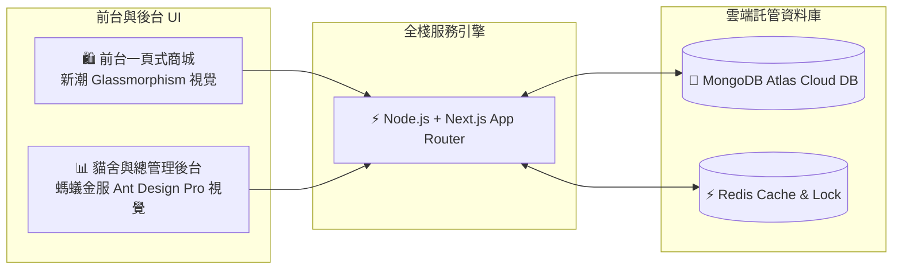
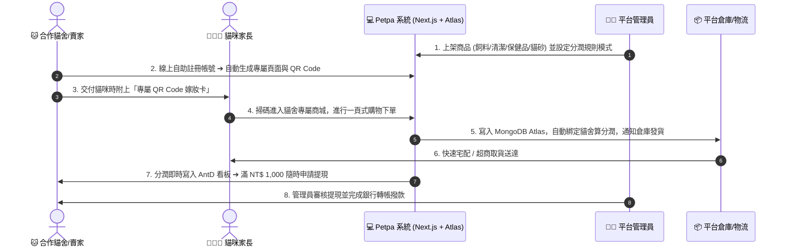
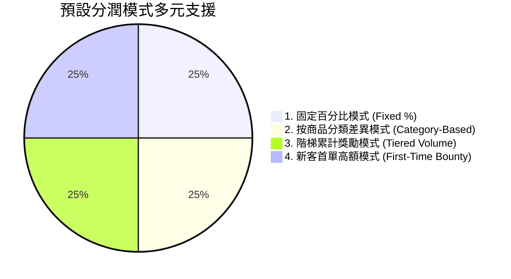

# 🐾 Petpa 寵物補給站 - 合作貓舍一頁式分潤電商企劃書 (Executive Overview)

> **版本**：v1.2 (實作優化版)  
> **目標**：打造可快速落地、高可行性、雙邊滿意（貓舍獲利、家長方便）的輕量級分潤電商平台。

---

## 📌 一、企劃核心概念 (Core Concept)

**Petpa 寵物補給站** 是一個以**「合作貓舍 / 賣家導流」**為核心的 B2B2C 一頁式分潤電商平台。

### 💡 商業模式四大支柱
1. **賣家/貓舍自助註冊 (Self-Service Partner Onboarding)**：貓舍線上註冊，系統自動派發專屬網址（如 `shop.petpa/?cattery=meow_house`）與專屬 **QR Code**，貓舍僅需專注於社群推廣與發放「幼貓新家嫁妝卡」。
2. **平台統一零庫存託管 (Centralized Platform Catalog & Fulfillment)**：所有商品採購、品管、自定義分類上架、訂價、包裝、出貨與開立發票**完全由 Petpa 平台管理員統一負責**。貓舍無須負擔任何囤貨成本與物流壓力。
3. **動態商品分類 (Dynamic Category Management)**：預設**飼料、清潔、保健品、貓砂**四大基礎品項，管理員可隨時動態擴充自定義分類（如凍乾零食、主食罐頭、貓抓板玩具）。
4. **多元靈活的分潤引擎 (Flexible Preset Commission Engine)**：內建 **4 大預設分潤規則模式**（固定百分比、分類差異分潤、階梯累計獎勵、新客首單高額獎勵），提供貓舍透明、可預期的收益回饋。

---

## 💻 二、技術架構與視覺風格規格 (Tech Stack & UI Specifications)

| 架構層級 | 選型技術 | 選型Rationale與優化細節 |
|---|---|---|
| **全棧核心** | **Node.js + Next.js (App Router)** | 前後端一體化，高效率 Server Actions 與 API Routes，SEO 友善與快速載入 |
| **主資料庫** | **MongoDB Atlas (雲端託管)** | 先行採用 MongoDB Atlas 免費/彈性雲端叢集，無須自建 DB 節點，開發與上線最迅速 |
| **快取與鎖** | **Redis (Upstash / Redis Cloud)** | 處理購物車暫存、貓舍 Referral 綁定 Session、熱門商品庫存原子扣減防超賣 |
| **貓舍控制台** | **螞蟻金融風格 (Ant Design Pro)** | 深藍與極簡商用質感，提供數據 KPI 大盤、導流趨勢圖、對帳明細與一鍵提現 |
| **前台商城** | **新潮活潑風格 (Trendy Glassmorphism)** | 行動端優先 (Mobile-First)，半透明玻璃卡片、暖色漸層，30 秒內快速完成一頁下單 |

---

## 🔄 三、全系統完整閉環運作流程 (End-to-End Workflow)

---

## 📊 四、4 大預設分潤規則模式與分類摘要

1. **固定百分比模式**：全站統一特定 %（如 15%），簡單好算。
2. **按商品分類差異模式**：
   - 💊 **保健品**：**25%**（高毛利高獎勵）
   - 🧼 **清潔用品**：**20%**
   - 🍚 **飼料糧食**：**15%**
   - 🏖️ **貓砂大宗**：**10%**（跑量低毛利）
3. **階梯累計獎勵模式**：當月導流越高比率越高（如 12% ➔ 15% ➔ 18%）。
4. **新客首單高額模式**：家長首單給予高額獎勵（20%），後續回購維持固定比率（12%）。

---

## 🎯 五、第一階段 (MVP) 開發與上線里程碑

1. **MongoDB Atlas 資料庫建立與連線配置**（`MONGODB_URI` 部署環境變數設定）。
2. **賣家自助註冊與 Ant Design 風格分潤控制台**（KPI 卡片、導流趨勢折線圖、提現功能）。
3. **平台管理員控制台**（自定義動態商品分類、商品管理、4 大分潤規則切換）。
4. **新潮 Glassmorphism 前台一頁式商城**（貓舍專屬頁面標頭、動態分類頁籤、購物車、綠界金流串接）。
