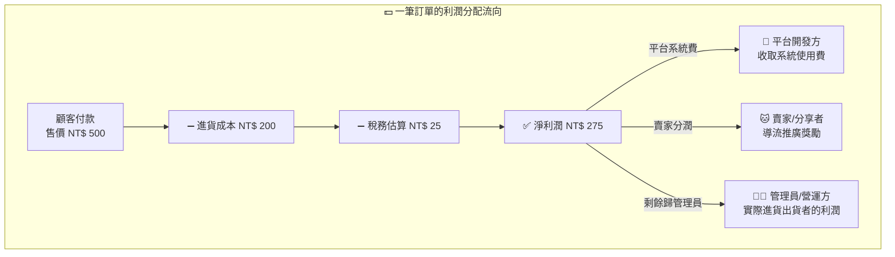

# 🐾 Petpa 寵物補給站 - 合作貓舍一頁式分潤電商企劃書 (Executive Overview)

> **版本**：v1.3 (營運模型定稿版)

---

## 📌 一、企劃核心概念

**Petpa 寵物補給站** 是一套以「合作貓舍/賣家導流」為核心的 B2B2C 分潤電商平台系統。

### 三方合作模型：誰做什麼？誰賺什麼？

| 角色 | 誰是這個人？ | 做什麼事？ | 怎麼賺錢？ |
|---|---|---|---|
| **🏢 平台開發方 (Platform)** | Petpa 系統的開發與維護團隊 | 開發系統、維護伺服器、提供金流與技術支援 | 每筆訂單淨利潤抽取**平台系統費**（如 10%） |
| **👨‍💼 管理員/營運方 (Operator)** | 委託平台開發系統的實際經營者 | 招募更多賣家加入宣傳、負責商品進貨/品管/包裝/出貨/開發票 | 淨利潤扣除平台費與賣家分潤後，**剩餘全部歸管理員** |
| **🐱 賣家/分享者 (Seller)** | 合作貓舍、寵物社群 KOL、推廣者 | 註冊帳號創建專屬頁面、發放 QR Code、社群宣傳導流 | 每筆導流訂單淨利潤抽取**賣家分潤**（如 15%） |

### 💡 一句話說清楚
> **管理員請平台開發好系統** ➔ **管理員招募賣家加入創建自己的推廣頁面** ➔ **賣家負責宣傳導流** ➔ **管理員負責進貨包裝出貨** ➔ **賺到的淨利潤分三份：平台收系統費、賣家收推廣費、管理員自己賺剩下的**。

---

## 💰 二、盈利分潤模型與淨利潤試算

### 2.1 淨利潤計算公式

$$\text{淨利潤} = \text{售價} - \text{進貨成本} - \text{估算稅金}$$

$$\text{管理員實際利潤} = \text{淨利潤} - \text{平台系統費} - \text{賣家分潤}$$

### 2.2 實際試算範例

假設一件商品：售價 NT$ 500、進貨成本 NT$ 200、稅率 5%

| 項目 | 金額 / 比例 | 說明 |
|---|---|---|
| 售價 (Selling Price) | NT$ 500 | 顧客實際付款金額 |
| 進貨成本 (Cost) | NT$ 200 | 管理員實際採購成本 |
| 估算稅金 (Est. Tax) | NT$ 25 | 售價 × 5%（*僅供估算參考*） |
| **淨利潤 (Net Profit)** | **NT$ 275** | 售價 - 成本 - 稅金 |
| 🏢 平台系統費 (10.0%) | NT$ 27.5 | 平台開發方收取 |
| 🐱 賣家分潤 (15.0%) | NT$ 41.25 | 賣家/分享者收取 |
| 👨‍💼 **管理員實際利潤 (75.0%)** | **NT$ 206.25** | **剩餘全部歸管理員** |

> ⚠️ **稅務聲明**：系統中顯示的稅金為**估算參考值**，實際稅務申報請依據當地稅法與會計師建議辦理。系統提供估算功能旨在協助管理員快速評估商品定價與利潤空間。

---

## 💻 三、技術選型與視覺風格

| 架構層級 | 選型技術 | 說明 |
|---|---|---|
| **全棧核心** | Node.js + Next.js (App Router) | 前後端一體化 |
| **主資料庫** | MongoDB Atlas (雲端託管) | 免運維、彈性擴展 |
| **快取與鎖** | Redis (Upstash / Redis Cloud) | 購物車、防超賣 |
| **管理員後台** | 螞蟻金融風格 (Ant Design Pro) | 利潤報表、商品成本管理、社群製圖 |
| **前台商城** | 新潮 Glassmorphism 風格 | 行動端優先、30 秒快速下單 |

---

## 🗂️ 四、商品分類與分潤設定摘要

### 4.1 自定義動態商品分類
- **基本預設**：🍚 飼料 | 🧼 清潔 | 💊 保健品 | 🏖️ 貓砂
- **動態擴充**：管理員可隨時新增/編輯分類（凍乾零食、罐頭、玩具⋯）

### 4.2 分潤精細度
- **最小調整單位**：**0.5%**（可設定 10.0%、10.5%、11.0%⋯）
- **平台系統費 + 賣家分潤 = 從淨利潤中扣除，剩餘歸管理員**

### 4.3 4 大預設賣家分潤模式
1. **固定百分比**：全站統一賣家分潤（如淨利潤的 15%）
2. **按商品分類差異**：保健品 20% / 清潔 15% / 飼料 12% / 貓砂 8%
3. **階梯累計獎勵**：賣家月導流越高，分潤比例越高
4. **新客首單高額**：新家長首單賣家分潤 20%，後續回購 10%

---

## 🎯 五、第一階段 (MVP) 開發里程碑

1. MongoDB Atlas 連線與基礎 Schema 建立
2. 管理員後台：商品管理（含成本/售價/稅率/淨利潤即時預覽）
3. 管理員後台：三方分潤比例設定（0.5% 步長，管理員利潤 = 剩餘）
4. 管理員後台：社群行銷快速製圖工具（FB/IG/LINE 尺寸）
5. 賣家自助註冊與專屬頁面 QR Code 生成
6. 賣家 AntD 分潤控制台（顯示賣家淨分潤，不公開成本與管理員利潤）
7. 前台新潮 Glassmorphism 一頁式商城與金流串接
