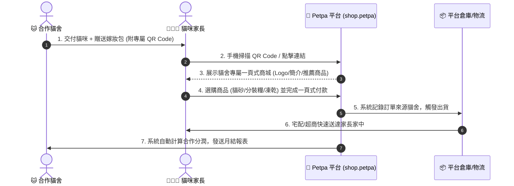

# 🐾 Petpa 寵物補給站 - 合作貓舍一頁式電商企劃書 (Executive Overview)

## 📌 一、企劃核心概念 (Core Concept)

**Petpa 寵物補給站** 旨在打造一個**以「合作貓舍」為核心**的一頁式電商購物平台。

當新手家長向合作貓舍帶回幼貓時，貓舍會提供附有專屬 **QR Code** 的「新家嫁妝包」或推薦卡。家長掃碼後，即可直接進入**該貓舍的專屬商城頁面**，方便購買貓咪習慣使用的貓砂、分裝飼料與凍乾零食。

本平台巧妙串聯「貓咪交付」與「家長後續日常用品回購」，讓貓舍獲得長期分潤收益，同時為家長提供極簡、信任度高的回購管道，平台則統一負責商品、庫存、金流與物流出貨。

---

## 🔄 二、整體營運流程 (End-to-End Workflow)

---

## 🏠 三、合作貓舍專屬頁面 (Cattery Custom Storefront)

每一家合作貓舍皆擁有**獨立的專屬頁面與專屬 QR Code**，提升貓舍的專業品牌形象：
- **專屬品牌展示**：自訂貓舍名稱、Logo、介紹與育種理念。
- **貓舍主打/推薦商品**：貓舍可選出專屬推薦清單（如幼貓銜接飼料組合、指定貓砂）。
- **專屬 QR Code 與網址**：例如 `shop.petpa/?cattery=meow_house`，讓貓舍感覺這是自己的專屬線上商城。

---

## 🥩 四、初期商品規劃 (Product Focus)

第一階段聚焦於高頻回購之核心貓用消耗品，並針對行動裝置進行最佳化購買設計：
1. **貓砂 (Cat Litter)**：豆腐砂、礦砂、木屑砂等大宗回購品項。
2. **分裝飼料 (Portioned Cat Food)**：提供適口性佳、小包裝鮮採分裝之幼貓與成貓主糧。
3. **凍乾零食 (Freeze-Dried Treats)**：高蛋白、單一肉源零食與獎勵品。
4. *（未來擴充）*：罐頭、貓抓板、日常清潔保健用品。

---

## 💳 五、購物流程與金流規劃 (Checkout & Payment)

- **最少步驟購物**：掃碼進入 ➔ 點選數量 ➔ 填寫收件資訊 ➔ 付款，全程在單頁 30 秒內完成。
- **靈活金流支援**：支援信用卡、LINE Pay、超商代碼/條碼與貨到付款，降低下單阻力。

---

## 📊 六、後台與分潤機制 (Referral & Backoffice)

- **權責分工**：
  - **合作貓舍**：負責精準導流、推薦與品質背書。
  - **Petpa 平台**：負責商品備貨、倉儲包裝、金流收款、發票開立與物流配送。
- **訂單來源追蹤**：系統於 Session / Cookie / 資料庫中永久綁定貓舍代碼（`catteryId`），即使家長未來直接回購，仍能正確歸屬至原貓舍並計算分潤。

---

## 🎯 七、第一階段 (MVP) 開發重點

先行完成**可實際運作的基本版本**，確保商業閉環能快速上線驗證：
1. **貓舍專屬頁面範本**與 QR Code 帶參路由。
2. **三類核心商品（貓砂、分裝糧、凍乾）展示與一頁購物車**。
3. **金流介接與訂單建立**。
4. **訂單來源追蹤 (Referral Tracking) 與貓舍基礎統計後台**。
