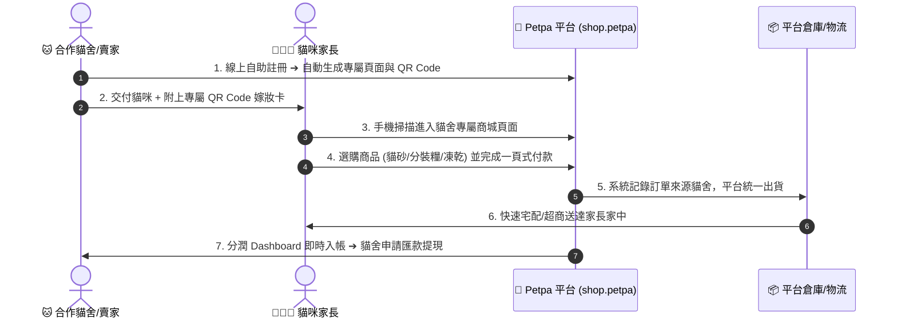

# 🐾 Petpa 寵物補給站 - 合作貓舍一頁式電商企劃書 (Executive Overview)

## 📌 一、企劃核心概念 (Core Concept)

**Petpa 寵物補給站** 旨在打造一個**以「合作貓舍/賣家」為中心**的分潤式一頁式電商購物平台。

### 核心模式：賣家自助註冊 ✕ 平台統一管貨 ✕ 數據化分潤看板
1. **賣家/貓舍自助註冊**：賣家註冊帳號後，系統自動生成專屬的一頁式商城與專屬 QR Code。賣家只需自訂品牌 Logo、介紹與收款帳戶，無需煩惱商品採購與庫存。
2. **平台統一控貨與出貨**：所有商品（貓砂、分裝飼料、凍乾零食）均由 Petpa 平台管理員統一上架、包裝、出貨與開立發票。
3. **極致美觀的分潤 Dashboard**：貓舍擁有一套螞蟻金融風格 (Ant Design Pro Style) 的專屬分潤看板，即時查看導流訂單、收益對帳與一鍵下載專屬 QR Code 嫁妝卡。

---

## 💻 二、技術選型與視覺風格總覽 (Tech Stack & Design Styles)

1. **核心架構 (Core Stack)**：**Node.js + Next.js (App Router)** 全棧架構，支援動態 SSR 與高併發處理。
2. **資料庫層 (Database Layer)**：
   - **MongoDB**：儲存貓舍賣家帳號、商品目錄、訂單與分潤紀錄。
   - **Redis**：處理購物車 Session、貓舍 QR Code 導流對照快取、防超賣分散式鎖。
3. **貓舍/賣家分潤控制台 (Partner Dashboard)**：**螞蟻金融風格 (Ant Design Pro)** — 美觀的雙色/深藍專業大盤、分潤趨勢圖表、對帳表格與一鍵申請提現功能。
4. **前台一頁式商城 (Storefront UI Style)**：**新潮活潑 (Trendy Glassmorphism)** — 行動端優先 (Mobile-First)、玻璃擬態卡片、暖色調活力漸層、極簡 30 秒下單體驗。

---

## 🔄 三、整體營運流程 (End-to-End Workflow)

---

## 🏠 四、貓舍自助註冊與專屬頁面 (Partner Registration & Custom Storefront)

- **自助註冊審核**：貓舍線上填寫名稱、聯絡資訊與匯款帳號，系統審核後自動開通。
- **專屬品牌展示**：自訂貓舍名稱、Logo、品牌簡介與育種理念。
- **專屬工具包**：一鍵下載高清專屬 QR Code 圖檔（供印製嫁妝包卡片），一鍵複製推薦連結。

---

## 🥩 五、商品統一管理 (Centralized Catalog Management)

- **商品完全由平台管理員統一控管**：賣家無需上架商品或負擔庫存壓力。
- **初期三大核心品項**：
  1. **貓砂 (Cat Litter)**：豆腐砂、礦砂等大宗回購品項。
  2. **分裝飼料 (Portioned Cat Food)**：鮮採小包裝幼貓與成貓主糧。
  3. **凍乾零食 (Freeze-Dried Treats)**：原肉高蛋白零食與獎勵品。

---

## 📊 六、美觀的貓舍分潤控制台 (Ant Design Partner Dashboard)

專為貓舍/賣家設計的螞蟻金融風數據大盤：
- **四大核心 KPI 卡片**：本月預估分潤、可提領餘額、總導流訂單數、顧客回購率。
- **動態圖表看板**：每日/每週導流銷售趨勢折線圖、熱門回購商品圓餅圖。
- **分潤明細與提現**：每筆訂單分潤歷程清晰透明，支援一鍵申請提現至指定銀行帳戶。

---

## 🎯 七、第一階段 (MVP) 開發重點

1. **貓舍自助註冊與賣家帳號管理**。
2. **貓舍專屬頁面動態生成與 QR Code 導流**。
3. **平台管理員商品統一上架與庫存管理**。
4. **一頁式購物車與金流串接**。
5. **螞蟻金融風貓舍分潤控制台與訂單來源追蹤**。
