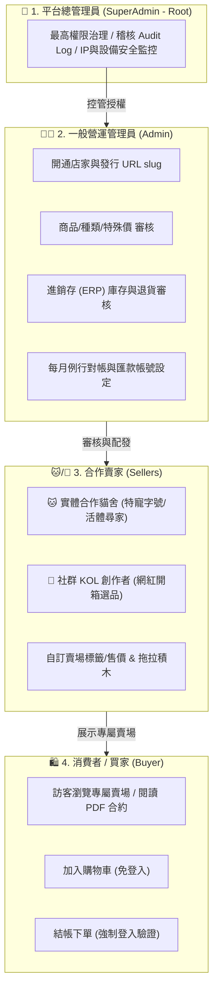
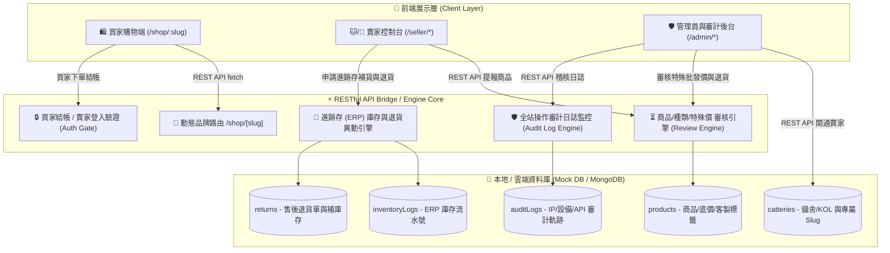
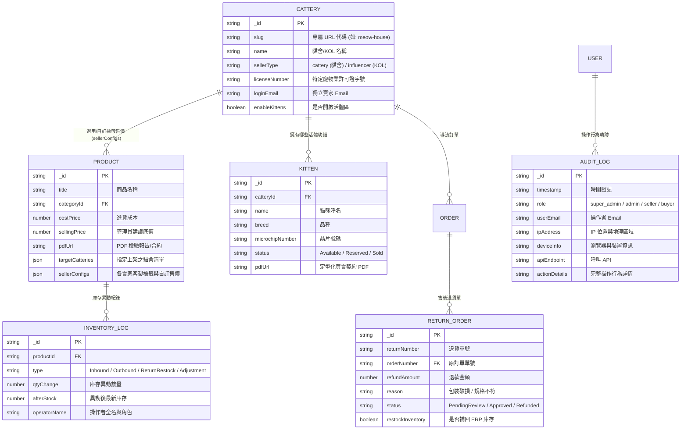
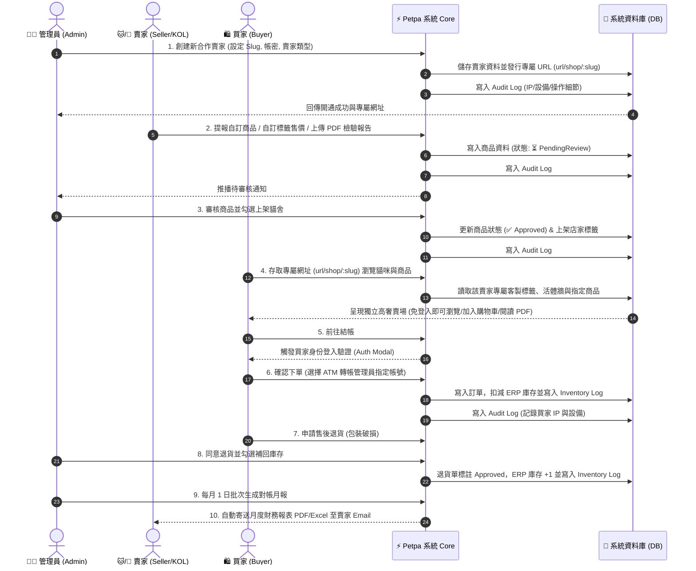

# 🐾 Petpa 寵物補給站 | 合作貓舍 & 社群 KOL 一頁式獨立專屬購物平台

> **Petpa (Pet Supply Station)** 是專為合作貓舍、社群網紅 (Influencer KOL) 與特寵業者打造的高奢一頁式品牌購物平台。
> 提供賣家專屬 URL 網址 (`url/shop/:slug`)、獨立帳號密碼、特寵許可字號登錄、社群 KOL 選品開箱、進銷存 (ERP) 庫存流水帳、退貨售後處理、PDF 定型化契約/檢驗證明閱讀器、影音廣告 Header 拖拉積木，以及平台特權級別的 **全站系統操作審計日誌 (Audit Log)**。

---

## 👥 1. 四種使用者角色權限圖 (4 User Roles Hierarchy)



---

## 🔌 ⚡ 前後端分離架構 (Decoupled Architecture & RESTful API)

> **Petpa** 採用嚴格的 **前後端分離 (Decoupled Architecture)** 規範：
> 前端 Client 僅負責介面渲染與 UI 狀態維護，所有數據查詢、異動、進銷存庫存補貨、退貨審核與 Audit Log 紀錄皆經由高層級的 **JSON RESTful API Endpoints** 進行解耦傳輸。

```mermaid
graph LR
    subgraph Frontend ["🎨 前端 Client 視圖層 (Decoupled UI)"]
        ReactUI["React Component / Dynamic Page"]
    end

    subgraph APIBridge ["🔌 JSON RESTful API Gateway"]
        ShopAPI["GET /api/v1/shop/:slug"]
        AdminSellersAPI["POST /api/v1/admin/sellers"]
        AuditLogsAPI["GET /api/v1/admin/audit-logs"]
    end

    subgraph BackendStore ["💾 後端資料服務層 (Backend Service & DB)"]
        CoreDB[(MongoDB / Mock DB)]
        AuditStore[(Audit Trail Store)]
    end

    ReactUI -->|1. fetch(HTTP GET/POST)| APIBridge
    ShopAPI -->|2. JSON Payload| CoreDB
    AdminSellersAPI -->|3. JSON Response| CoreDB
    AuditLogsAPI -->|4. Audit Tracking| AuditStore
```

### 📡 核心 RESTful API 接口清單

| 方法 | Endpoint | 權限角色 | 功能說明 |
| :--- | :--- | :--- | :--- |
| `GET` | `/api/v1/shop/:slug` | 🛍️ 買家 / 訪客 | 獲取賣家專屬頁面、客製標籤售價、活體幼貓與商品列表 |
| `POST` | `/api/v1/admin/sellers` | 👨‍💼 管理員 | 前後端分離開通新賣家 (發行 Slug, Email, 密碼與特寵字號) |
| `GET` | `/api/v1/admin/audit-logs` | 👑 總管理員 | 獲取全站操作軌跡日誌 (含 IP、使用設備與 API 詳細內容) |

---

## 📸 2. 系統總體架構圖 (System Architecture Diagram)



---

## 💾 3. 系統資料實體關係圖 (Data ER Diagram / Schema)



---

## 🔄 4. 業務資料流向圖 (Data Flow Sequence Diagram)



---

## 🔥 已實現最新完整功能 (Implemented Features)

### 1. 📱 社群行銷類賣家 (Influencer / KOL Seller)
* **賣家角色雙軌化**：後台開通時支援選取 **`🐱 實體合作貓舍`**（須填特寵字號、開放幼貓專區）與 **`📱 社群 KOL 賣家`**（連結 IG/YouTube/FB 粉絲專頁與粉絲數，免填特寵字號）。
* **網紅聯名專屬賣場**：社群賣家擁有獨立專屬網址 `/shop/cat-master-ig`，可開箱獨家商品與設定優惠活動。

### 2. 🏬 進銷存 (ERP) 庫存管理與異動歷史流水帳 (`/admin/inventory`)
* **進銷存四大異動類型**：支援 `📥 採購進貨入庫`、`📤 銷貨出庫扣減`、`🔄 退貨庫存補回` 與 `⚙️ 盤點差距微調`。
* **低庫存預警與即時更新**：全站商品庫存低於 100 件時自動跳出 Warning 預警，任何微調皆即時紀錄 **前後庫存對照與操作者全名**。

### 3. 🔄 售後退貨處理與自動補庫存 (`/admin/returns`)
* **完整退貨軟體介面**：提供買家退貨申請清單、退貨原因分析（如：*包裝破損*、*規格不符*）與預估退款總額。
* **一鍵同意並自動補回 ERP 庫存**：管理員核准退貨時，可一鍵勾選 **「自動將商品數量補回進銷存庫存」**，系統將自動於 ERP 寫入 `🔄 退貨入庫` 紀錄。

### 4. 🛡️ 平台特權級別系統操作審計日誌 Audit Log (`/admin/audit-logs`)
* **平台級安全監控**：完整紀錄 `SuperAdmin`、`Admin`、`Seller` 與 `Buyer` 所有操作軌跡。
* **四大權限屬性記錄**：
  1. **時間戳記 (Timestamp)**
  2. **IP 位置與實體地理區域** (如：`220.135.98.112 (台北市)`)
  3. **使用設備與瀏覽器** (如：`Chrome 128.0 (macOS 15.0)`)
  4. **呼叫 API Endpoint & 完整操作行為內容** (如：`POST /api/v1/seller/products/custom-config`)

---

## 🛠️ 運用技術 (Tech Stack)

| 領域 | 使用技術 / 框架 | 說明 |
| :--- | :--- | :--- |
| **核心框架** | **Next.js 16.3.5 (App Router)** | 使用 Turbopack 極速建置、Dynamic Route (`/shop/[slug]`) |
| **語言** | **TypeScript 5.x** | 全站嚴格型別定義與 API 介面約束 |
| **UI 樣式與設計** | **Vanilla CSS (Design Tokens)** | 手繪高奢現代 CSS 主題系統、Glassmorphism 玻璃擬物、現代 Outfit / Inter 字體 |
| **圖表與視覺化** | **Mermaid.js** | 流程圖、ER 模型圖、架構圖與時序圖視覺化呈現 |
| **圖案與媒體** | **Lucide Icons & WebP** | 極速載入優化與高解析度媒體展售 |
| **部署與構建** | **Node.js 20 LTS / Turbopack** | 支援 Server-side Rendering (SSR) 與預渲染 (Prerender) |

---

## 🔗 最新頁面測試路徑彙整

| 頁面分類 | 路由 Path | 功能說明 |
| :--- | :--- | :--- |
| **社群 KOL 賣家賣場** | `/shop/cat-master-ig` | 網紅專屬賣場、開箱用品與主題風格 |
| **進銷存 (ERP) 庫存管理** | `/admin/inventory` | 即時庫存表、進貨補貨與 ERP 異動流水帳 |
| **售後退貨管理** | `/admin/returns` | 買家退貨單審核、退款追蹤與自動補庫存 |
| **平台審計日誌 (Audit Log)** | `/admin/audit-logs` | 最高管理員稽核 IP、設備、API 與全站操作軌跡 |
| **賣家自訂標籤與售價** | `/seller/products` | 賣家自訂專屬標籤、售價與高量批發價合約申請 |
| **管理員匯款帳號設定** | `/admin/commission` | 設定平台收款與對帳主要銀行帳戶 |
