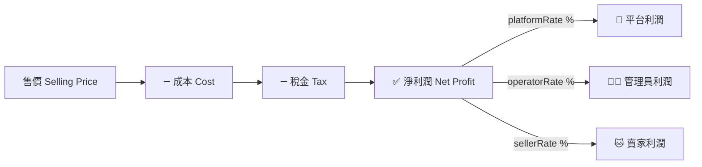
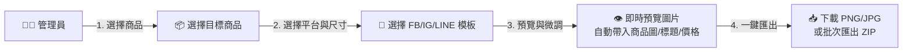
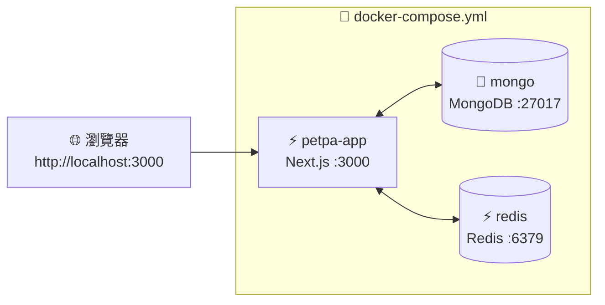

# 🛠️ Petpa 寵物補給站 - 系統規劃與技術架構設計書 (System Design)

本文檔詳細定義 **Petpa 合作貓舍/賣家分潤平台** 之系統架構（含三方淨利潤分配引擎）、MongoDB Atlas Schemas、Redis 快取設計、社群行銷快速製圖模組、AntD 後台與 Glassmorphism 前台 UI 組件架構，以及完整 API 規範。

---

## 🏗️ 1. 系統架構 Topology

```mermaid
flowchart TD
    subgraph Clients [📱 使用者介面 (Next.js App Router)]
        ShopUI[🛍️ 前台一頁式商城<br>Glassmorphism 風格]
        PartnerUI[📊 賣家分潤控制台<br>AntD Pro 風格]
        AdminUI[⚙️ 管理員總管理後台<br>AntD Pro 風格]
    end

    subgraph Engine [⚡ Next.js API & Server Actions]
        AuthModule[🔑 身份驗證 & JWT]
        CategoryEngine[📁 動態分類管理]
        ProfitEngine[💰 三方淨利潤分配引擎<br>0.5% 精細粒度]
        OrderEngine[🛒 一頁式下單 & 金流]
        SocialEngine[📱 社群快速製圖工具<br>FB / IG / LINE 尺寸]
    end

    subgraph Storage [☁️ 雲端託管資料與快取]
        Atlas[(🍃 MongoDB Atlas)]
        Redis[(⚡ Redis Cache & Lock)]
    end

    ShopUI --> Engine
    PartnerUI --> Engine
    AdminUI --> Engine

    Engine <---> Atlas
    Engine <---> Redis
```

---

## 💰 2. 三方淨利潤分配引擎設計 (Three-Way Profit Split Engine)

### 2.1 淨利潤計算與分配流程


### 2.2 分配精細度規範
- **最小調整單位**：**0.5%**（可設定 10.0%、10.5%、11.0%⋯等）。
- **驗證規則**：`platformRate + operatorRate + sellerRate === 100.0%`，系統於儲存時強制校驗。

---

## 🗄️ 3. MongoDB Atlas Schemas

### 3.1 商品模型 (`Product`) — 含成本、稅率與淨利潤

```typescript
interface IProduct {
  _id: string;
  title: string;
  categoryId: string;

  // === 成本與定價 (Admin Only 可見) ===
  costPrice: number;         // 進貨成本 (例: 200)
  sellingPrice: number;      // 售價 (例: 500)
  originalPrice?: number;    // 劃線原價 (行銷展示用, 例: 650)
  taxRate: number;           // 營業稅率 (例: 0.05 = 5%)
  // 以下由系統自動計算
  taxAmount: number;         // 稅金 = sellingPrice × taxRate (例: 25)
  netProfit: number;         // 淨利潤 = sellingPrice - costPrice - taxAmount (例: 275)
  marginRate: number;        // 毛利率 = netProfit / sellingPrice (例: 0.55)

  // === 庫存與展示 ===
  stock: number;
  images: string[];
  specifications: { name: string; value: string }[];
  isRecommended: boolean;
  isActive: boolean;

  // === 獨立分潤覆寫 (可選，蓋過全站/分類設定) ===
  customProfitSplit?: {
    platformRate: number;    // 例: 20.0
    operatorRate: number;    // 例: 50.0
    sellerRate: number;      // 例: 30.0
  } | null;
}
```

### 3.2 全站三方分潤配置模型 (`ProfitSplitConfig`)

```typescript
interface IProfitSplitConfig {
  _id: string;
  name: string;              // "全站預設三方分潤" 或 "保健品專屬分潤"
  scope: 'GLOBAL' | 'CATEGORY' | 'PRODUCT'; // 適用範圍
  scopeId?: string;          // 若 scope 為 CATEGORY 或 PRODUCT，關聯對應 _id
  platformRate: number;      // 平台利潤占比 (例: 20.0)，單位 %，精度 0.5
  operatorRate: number;      // 管理員/營運方利潤占比 (例: 50.0)
  sellerRate: number;        // 賣家/分享者利潤占比 (例: 30.0)
  // 驗證：platformRate + operatorRate + sellerRate === 100.0
  isActive: boolean;
}
```

### 3.3 訂單模型 (`Order`) — 含三方利潤明細

```typescript
interface IOrder {
  _id: string;
  orderNumber: string;
  catteryId: string;         // 來源賣家/貓舍
  customer: {
    name: string;
    phone: string;
    email?: string;
    address: string;
  };
  items: {
    productId: string;
    title: string;
    quantity: number;
    unitPrice: number;       // 售價
    costPrice: number;       // 成本 (記錄當時快照)
    taxAmount: number;       // 稅金 (記錄當時快照)
    netProfit: number;       // 單品淨利潤
    subtotal: number;        // 售價 × 數量
  }[];
  subtotal: number;          // 商品售價總額
  shippingFee: number;
  totalAmount: number;       // 顧客實付金額 (含運費)

  // === 三方淨利潤分配 (下單時快照計算) ===
  profitBreakdown: {
    totalNetProfit: number;  // 訂單總淨利潤
    platformProfit: number;  // 🏢 平台所得
    operatorProfit: number;  // 👨‍💼 管理員所得
    sellerProfit: number;    // 🐱 賣家所得
    splitRateSnapshot: {     // 分配比例快照
      platformRate: number;
      operatorRate: number;
      sellerRate: number;
    };
  };

  paymentStatus: 'Pending' | 'Paid' | 'Failed';
  shippingStatus: 'Processing' | 'Shipped' | 'Completed' | 'Cancelled';
  createdAt: Date;
}
```

### 3.4 社群行銷圖模板模型 (`SocialTemplate`)

```typescript
interface ISocialTemplate {
  _id: string;
  name: string;              // "FB 動態貼文商品圖", "IG 方形商品圖"
  platform: 'facebook_feed' | 'facebook_story' | 'facebook_cover'
           | 'instagram_square' | 'instagram_portrait' | 'instagram_story'
           | 'line_rich';
  width: number;             // 例: 1200
  height: number;            // 例: 630
  aspectRatio: string;       // "1.91:1", "1:1", "9:16"
  layoutConfig: object;      // 模板排版設定 (文字/圖片/價格位置)
  isActive: boolean;
}
```

---

## 📱 4. 社群快速製圖模組 (Social Media Quick-Create Module)

### 4.1 支援之社群圖片尺寸

| 平台 | 用途 | 尺寸 (px) | 長寬比 |
|---|---|---|---|
| **Facebook** | 動態貼文 (Feed Post) | **1200 × 630** | 1.91 : 1 |
| **Facebook** | 限時動態 (Story) | **1080 × 1920** | 9 : 16 |
| **Facebook** | 封面照片 (Cover) | **820 × 312** | ~2.63 : 1 |
| **Instagram** | 方形貼文 (Square) | **1080 × 1080** | 1 : 1 |
| **Instagram** | 直式貼文 (Portrait) | **1080 × 1350** | 4 : 5 |
| **Instagram** | 限時動態 / Reels | **1080 × 1920** | 9 : 16 |
| **LINE** | 圖文訊息 (Rich Message) | **1040 × 1040** | 1 : 1 |

### 4.2 快速製圖功能流程


---

## 🎨 5. UI 組件架構

### 5.1 管理員後台 (AntD Pro)
- **商品管理頁**：表格含「成本」「售價」「稅率」「淨利潤」「毛利率」即時計算欄位。
- **三方分潤設定頁**：三個 `antd.InputNumber` (步長 0.5)，底部即時驗證 `合計 = 100%` 提示。
- **利潤報表頁**：展示全站 / 分管理員 / 分賣家之利潤走勢圖與累計金額。
- **社群製圖頁**：選擇商品 ➔ 選擇模板 ➔ Canvas 即時預覽 ➔ 一鍵下載/批次匯出。

### 5.2 賣家分潤控制台 (AntD Pro)
- **KPI 卡片**：本月賣家淨分潤（賣家僅看到自己的利潤金額，不顯示成本與平台/管理員利潤）。
- **導流訂單明細**：顯示訂單號、商品、售價與「我的分潤所得」金額欄位。

---

## 🔌 6. API 介面規範 (API Specifications)

| HTTP Method | Endpoint | 說明 | 權限 |
|---|---|---|---|
| `POST` | `/api/v1/admin/products` | 新增商品 (含 costPrice, taxRate, 自動算淨利潤) | Admin |
| `GET` | `/api/v1/admin/profit-overview` | 全站三方利潤報表 (平台/管理員/賣家分別統計) | Admin |
| `PUT` | `/api/v1/admin/profit-split` | 設定/修改三方分潤比例 (0.5% 步長, 驗證合計=100%) | Admin |
| `POST` | `/api/v1/admin/social-image` | 社群快速製圖 (指定商品+模板, 返回圖片 URL) | Admin |
| `GET` | `/api/v1/partner/dashboard` | 賣家分潤看板 (僅顯示賣家利潤, 不洩露成本) | Cattery |
| `POST` | `/api/v1/orders` | 一頁式下單 (系統自動計算三方淨利潤分配) | Public |

---

## 🐳 7. 本地開發環境 (Docker Compose)

本地開發使用 **Docker + docker-compose** 一鍵啟動全部服務（Next.js App + MongoDB + Redis），無需安裝 K8s 或其他叢集工具。

### 7.1 架構拓撲 (Local)



### 7.2 docker-compose.yml 規格

```yaml
version: '3.8'

services:
  # Next.js 全棧應用
  petpa-app:
    build:
      context: .
      dockerfile: Dockerfile
    ports:
      - "3000:3000"
    environment:
      - NODE_ENV=development
      - MONGODB_URI=mongodb://mongo:27017/petpa
      - REDIS_URL=redis://redis:6379
    depends_on:
      - mongo
      - redis
    volumes:
      - .:/app
      - /app/node_modules
      - /app/.next

  # MongoDB 本地實例
  mongo:
    image: mongo:7
    ports:
      - "27017:27017"
    volumes:
      - mongo_data:/data/db

  # Redis 本地實例
  redis:
    image: redis:7-alpine
    ports:
      - "6379:6379"

volumes:
  mongo_data:
```

### 7.3 Dockerfile 規格

```dockerfile
FROM node:20-alpine

WORKDIR /app

COPY package*.json ./
RUN npm install

COPY . .

EXPOSE 3000
CMD ["npm", "run", "dev"]
```

### 7.4 本地與正式環境對照

| 項目 | 本地 (Docker Compose) | 正式 (K8s + ArgoCD) |
|---|---|---|
| **啟動方式** | `docker compose up -d` | ArgoCD 自動同步 `prod/petpa.yaml` |
| **Next.js App** | Docker Container `:3000` | K8s Deployment Pod `:3000` |
| **MongoDB** | 本地 Container `mongo:7` | MongoDB Atlas 雲端託管 |
| **Redis** | 本地 Container `redis:7-alpine` | Upstash / Redis Cloud |
| **網域** | `http://localhost:3000` | `https://shop.petpa` |

